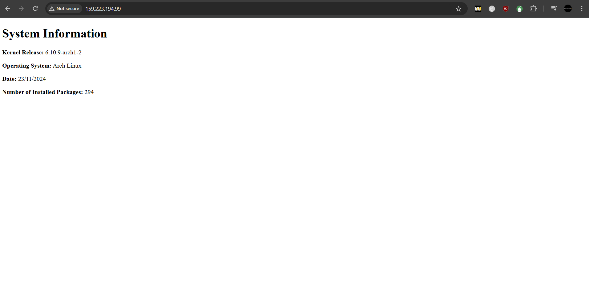

# Assignment 3 part 1


## Overview
The goal of this assignment is to setup a Bash script that generates a static index.html file that contains some system information. The script will be configured to run at 05:00 using a `systemd` service and timer. The HTML document will be served with a nginx web server that will run on an Arch droplet along with a firewall using `ufw`.

## Requirements:

In order to follow along with this assignment you must have this git repository cloned:

```bash
git clone https://git.sr.ht/~nathan_climbs/2420-as2-start ~
```

Once this repository has been cloned to your home, you are now ready to begin.
# Task1
### System user 
This system user has to meet these requirements:
1. username: `webgen`
2. home directory: `/var/lib/webgen`
3. a login shell appropriate for a non-login user
4. ownership of the home directory and all of its sub-directories and files

Note: This might not be the best way to create this system user but this is how I have gone about it.


To create this system user run this command:
```bash
sudo useradd --system -s /usr/bin/nologin webgen
```

To confirm this user was created you need to check the contents of `/etc/passwd` this new system user should be at the bottom

the home directory for the user will be /home/webgen.
to change the home directory to whatever you want run usermod like so:
```bash
sudo usermod -d /var/lib/webgen -m webgen
```
This will change the current home directory to what is specified after the -d flag

now make the specified directory structure using the make directory command `mkdir`

```bash 
/var/lib/webgen/ 
├── bin/ 
│ 	└── generate_index 
└── HTML/ 
	└── index.html
```

Note: you will have to move the script called generate_index from the starter code we cloned into the new bin directory you make.

The final step would be to give ownership of all webgen files and directories to the webgen system user

```bash
chown -R webgen:webgen webgen/
```

we are creating and using systems users in this step because of security  
What is the benefit of creating a system user for this task rather than using a regular user or root?

# Task2

For this task we will need to create two files:
1. generate_index.service
2. generate_index.timer

you would need to move both of them to `/etc/systemd/systems` because that's where custom unit files go

we will first make the generate_index.service file. Inside this generate_index.service file we need to include the following components
```bash
[Unit]
Description=running the other file
Requires=network-online.target


[Service]
User=webgen
Group=webgen
ExecStart=/var/lib/webgen/bin/generate_index
```

The important parts of these scripts are:
1. Requires=network-online.target : which indicates that it should not run until the network-online target is active.
2. User and Group = webgen : this part makes it so only user webgen and group webgen ---can run this----
3. finally ExectStart : this part indicates the path to the place where we have our script

once we have all this included into the file we need to make sure nothing is wrong with the script and start it to make sure it works

To check that the script is good run:
```bash
systemd-analyze verify generate_index.service
```
if this returns nothing then it means that you are good

we want to make sure our script works so we will run:
```bash
sudo systemctl start generate_index.service
```

After this command you can check the status of the service by running the exact same command but replacing the start with status.

check `/var/lib/webgen/HTML` to see if there is an index.html file, if there is that means it has been successful

Now we can make the timer file:

the timer file should look something like this:
```bash
[Unit]
Description=running the service hopefully

[Timer]
OnCalendar=*-*-* 05:00:00
Persistent=true

[Install]
WantedBy=timers.target
```

the important components of this timer file consist of:
1. OnCalendar=*-*-* 05:00:00 : which indicates that it should run everyday at 5 o clock
2. WantedBy=timers.target : this indicates that all timers that should be active after boot will be

This timer file will control our service file made previously. Once everything look similar we can run the same commands to make sure everything looks the way it should

```bash
systemd-analyze verify generate_index.timer
```

We want this timer to start and be enabled so we will run this command

```bash
sudo systemctl enable --now generate_index.timer
```

This will activate the timer file and make it so that it starts from the beginning

How will you verify that the timer is active and the service runs successfully? What commands can you run to check logs and to confirm the service's execution

Important: Once both of these are done we will need to run `sudo systemctl daemon-reload` , this command makes the system aware of the changes 
# Task3

Why is it important to use a seperate server block file instead of modifying the main `nginx.conf` file directly?

How can you check the status of the nginx services and test your nginx configuration?
# Task4

How can you check the status of your firewall?


# Task5




# References:
